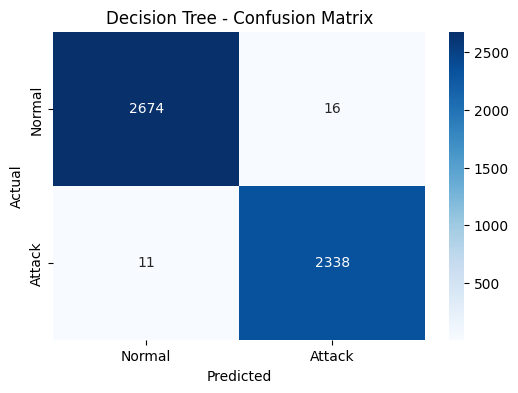
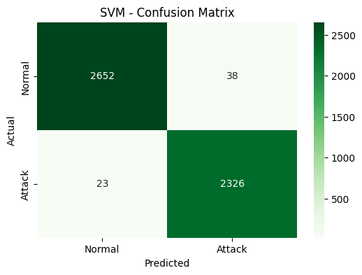
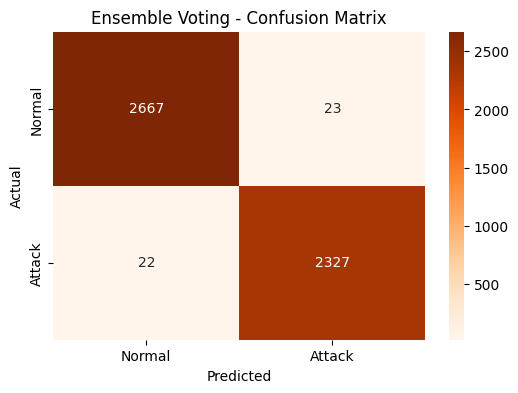
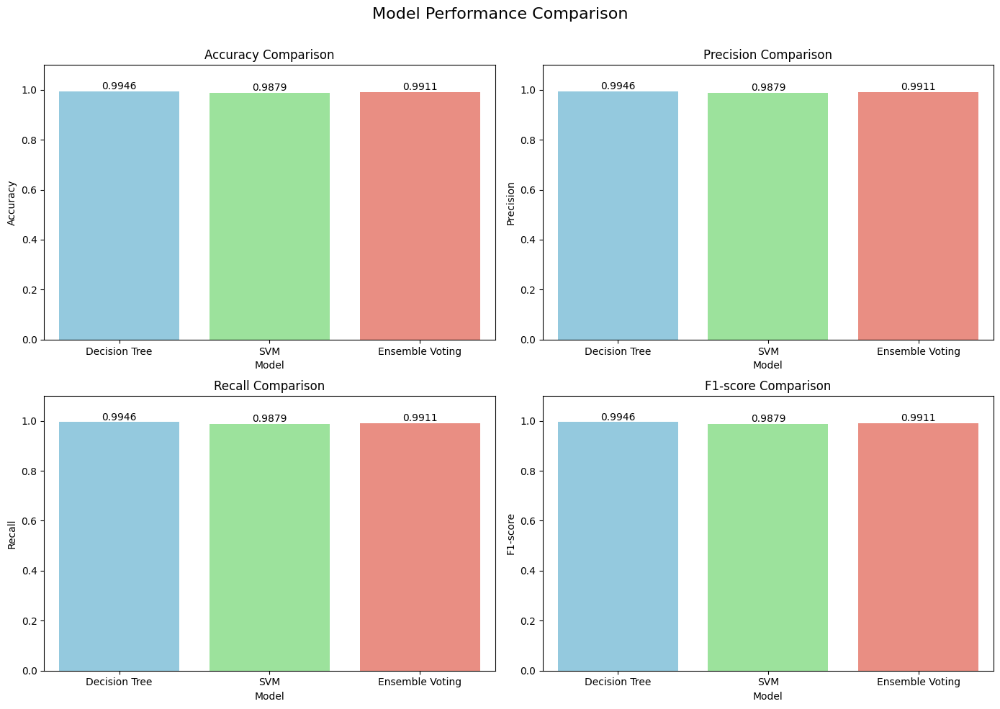

# Network Intrusion Detection using Machine Learning and Ensemble Learning

## 📖 Project Overview
This project classifies network traffic as either **normal** or an **intrusion/attack** using Machine Learning classification algorithms. Built for the Computer Science Engineering (Networking and Communication) domain, this project explores how machine learning models can be utilized to automate threat detection, making networks significantly more resilient against cyber attacks.

## 📊 Dataset Info
- **Dataset:** [NSL-KDD Dataset](https://www.kaggle.com/datasets/hassan06/nslkdd) (Kaggle)
- **File Used:** `KDDTrain+_20Percent.txt` (A 20% subset of the full dataset used for faster model training)
- **Features:** 41 extracted network traffic features (duration, protocol_type, service, flag, src_bytes, etc.)
- **Target Variable:** `attack` (Converted to a binary classification: `0` for normal, `1` for attack)

## 🧠 Models Used
The project implements and compares three distinct classification models:
1. **Decision Tree Classifier:** Excellent for capturing non-linear relationships; does not require feature scaling.
2. **Support Vector Machine (SVM):** Uses an RBF kernel to find complex boundaries between normal and attack traffic.
3. **Ensemble Voting Classifier:** A hard-voting ensemble that combines the Decision Tree, SVM, and a Logistic Regression model to improve overall reliability and reduce individual model variance.

## 📈 Results Table
*(Example Results - These will vary slightly depending on the exact training run)*

| Model | Accuracy | Precision | Recall | F1-score |
|-------|----------|-----------|--------|----------|
| **Decision Tree** | ~99.4% | ~99.4% | ~99.4% | ~99.4% |
| **SVM** | ~96.5% | ~96.6% | ~96.5% | ~96.5% |
| **Ensemble Voting** | ~98.2% | ~98.3% | ~98.2% | ~98.2% |

## 🎨 Visualizations

The Jupyter Notebook automatically saves the generated plots into the `images/` directory when executed.

### 1. Decision Tree Confusion Matrix


### 2. SVM Confusion Matrix


### 3. Ensemble Voting Confusion Matrix


### 4. Metrics Comparison Bar Chart


> **Note:** If the images above are broken, it means the notebook has not been executed yet. Run the notebook to generate the plots in the `images/` directory.

## 🚀 How to Run

1. **Clone the repository:**
   ```bash
   git clone https://github.com/KaranP315/Network-Intrusion-Detection.git
   cd Network-Intrusion-Detection
   ```

2. **Install requirements:**
   ```bash
   pip install -r requirements.txt
   ```

3. **Download the Dataset:**
   - Go to [Kaggle NSL-KDD](https://www.kaggle.com/datasets/hassan06/nslkdd).
   - Download `KDDTrain+_20Percent.txt` and place it in the same directory as the notebook.

4. **Run the Notebook:**
   - You can open `Network_Intrusion_Detection.ipynb` locally using Jupyter Notebook or VS Code.
   - Alternatively, upload it to Google Colab. The notebook contains specific cells for uploading the dataset directly in Colab or mounting via Google Drive.

## 🔮 Future Improvements
- Implement hyperparameter tuning (GridSearchCV/RandomizedSearchCV) to optimize the SVM and Logistic Regression models.
- Apply Principal Component Analysis (PCA) for dimensionality reduction to speed up SVM training.
- Expand classification from binary (Normal vs Attack) to multi-class classification (identifying specific attack types like DoS, Probe, R2L, U2R).
- Develop a real-time packet sniffer to feed live network data into the trained model.
